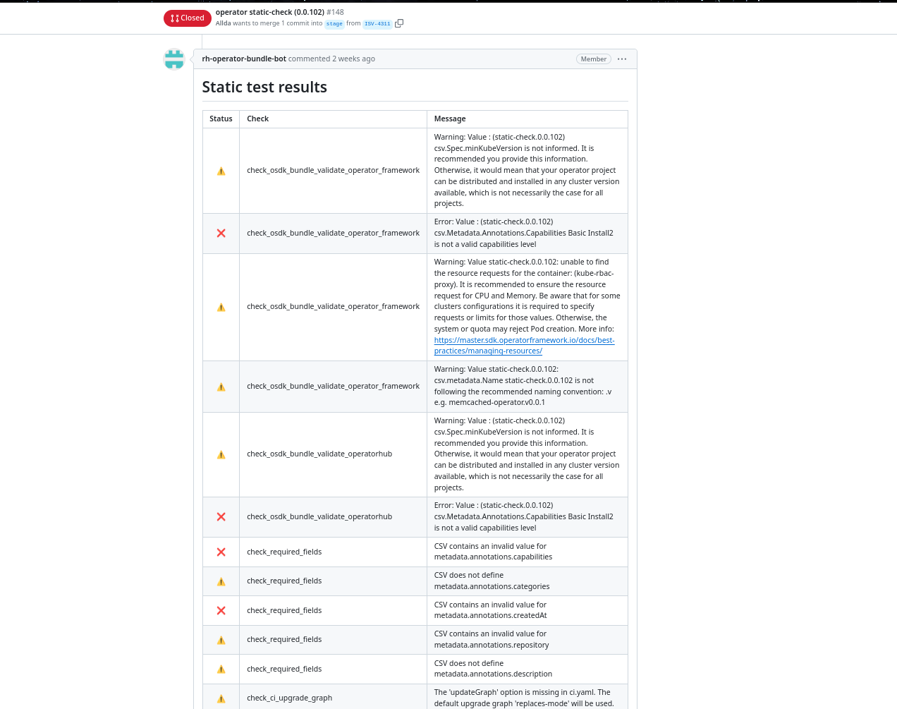
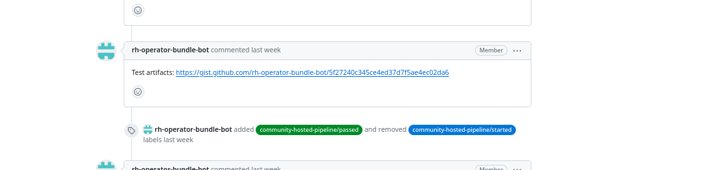
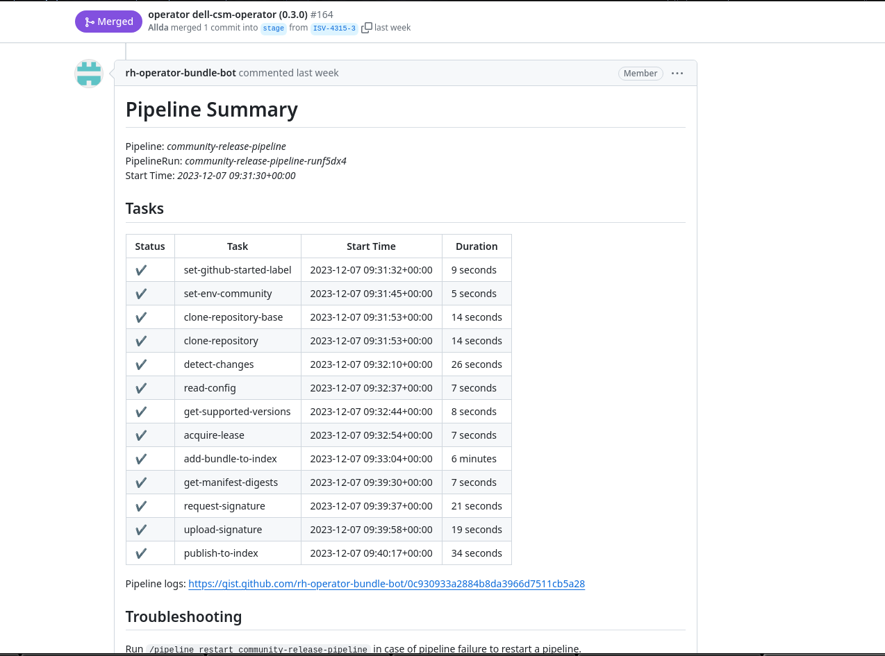

# community-operator-pipeline

The community operator pipeline provides a platform for openshift community contributors to validate, share, and distribute openshift operators.

The community operator pipeline is divided into two workflows:
1. The [community-hosted-pipeline](./community-operator-pipeline.md#community-hosted-pipeline) to test and validate the submitted operator bundle in the PR.
1. The [community-release-pipeline](./community-operator-pipeline.md#community-release-pipeline) to release the operator bundle to the catalog after the PR is merged.

## community-hosted-pipeline

The community hosted pipeline is used to test the submitted Operator bundles.

It is intended to be triggered upon the creation of an operator bundle pull request and successfully completes with merging it.

As part of the community hosted pipeline, the operator submitted in the PR will be tested in two different ways:

1. The static tests suite
1. The dynamic tests (Preflight tests)

>**Note** To learn more about preflight tests, please follow this [link](https://github.com/redhat-openshift-ecosystem/openshift-preflight?tab=readme-ov-file#preflight).

#### Static tests suite

As part of the static tests suite, set of a check suite will be run against the submitted bundle and will return warnings and failures (if any) in the operator-sdk bundle validate tool's JSON output format. This results will be posted into the PR.

Here is the example how the result will look like in the PR:

#### Dynamic tests (Preflight tests)

>**Note** The Preflight tests are the replacement of (orange/kiwi/lemon) test suits.

The preflight tests are designed to test and verify the the operator bundle content and the format of the operator bundle. The result link for the logs of the preflight test runs will be posted to the PR as shown below.

In case of failures, please have a look at the logs of specific tests. If an error is not clear to you, please ask in the PR. Maintainers will be happy to help you with it.

Once all of the tests will be passed successfully, the PR will be merged automatically based on the conditions are met by community-hosted-pipeline.

The PR will not merge automatically in the following cases:
1. If the brand-new operator is submitted.
1. If the author of the PR is not listed as a reviewer in the `ci.yaml` file for the respective operator or as a repository maintainer.

If there are any of the above cases, the PR needs to be reviewed by the Repositoy maintainers or authorized reviewers. After the approval, the PR needs to be merged manually. Once the PR will be merged, the community-release-pipeline will be triggered automatically.

>**NOTE:** The community hosted pipeline run results will be posted in the github PR comment.

## community-release-pipeline

The community release pipeline is responsible for releasing a bundle image which has passed the test validations via community-hosted-pipeline.
It's intended to be triggered automatically by the merge of a bundle pull request by the community hosted pipeline.
It successfully completes once the bundle has been published to the catalog.

>**NOTE:** The community release pipeline run results will be posted in the github PR comment.

### There are new github pull request labels have been introduced for the community operator pipeline.

| Label Name                               | Label Description                                                                           |
|------------------------------------------|---------------------------------------------------------------------------------------------|
| community-hosted-pipeline/started        | This label will be added to the PR when the hosted pipeline will be triggered.              |
| community-hosted-pipeline/passed         | This label will be added to the PR when the hosted pipeline will be passed successfully.    |
| community-hosted-pipeline/failed         | This label will be added to the PR when the hosted pipeline will be failed.                 |
| community-release-pipeline/started       | This label will be added to the PR when the release pipeline will be triggered.             |
| community-release-pipeline/passed        | This label will be added to the PR when the release pipeline will be passed successfully.   |
| community-release-pipeline/failed        | This label will be added to the PR when the release pipeline will be failed.                |
| validation-failed                        | This label will be added to the PR when the static tests will be failed in hosted pipeline. |
